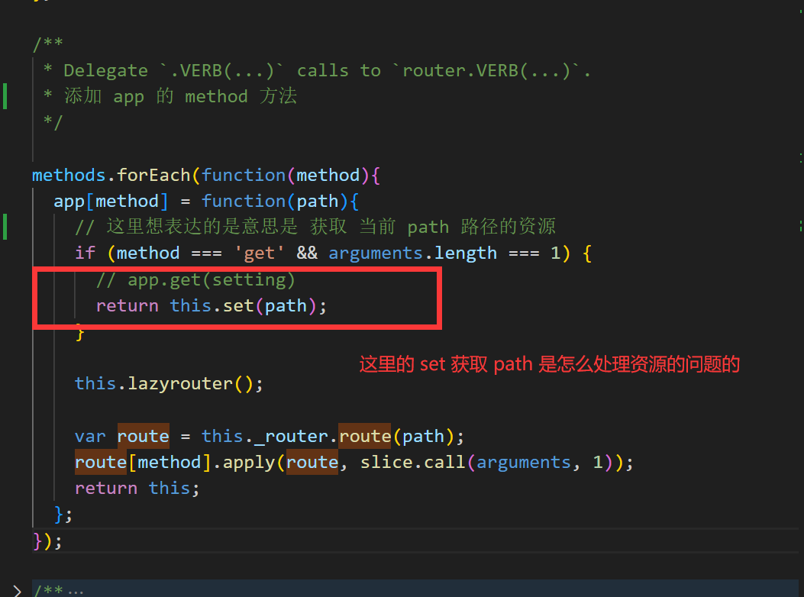
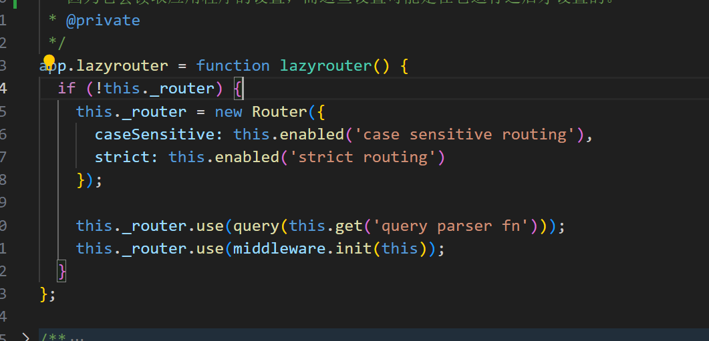
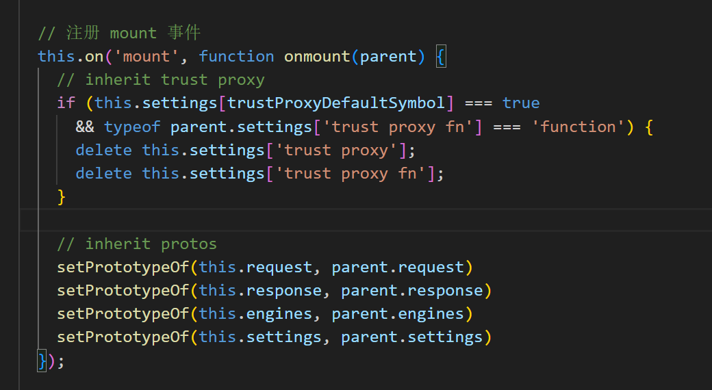
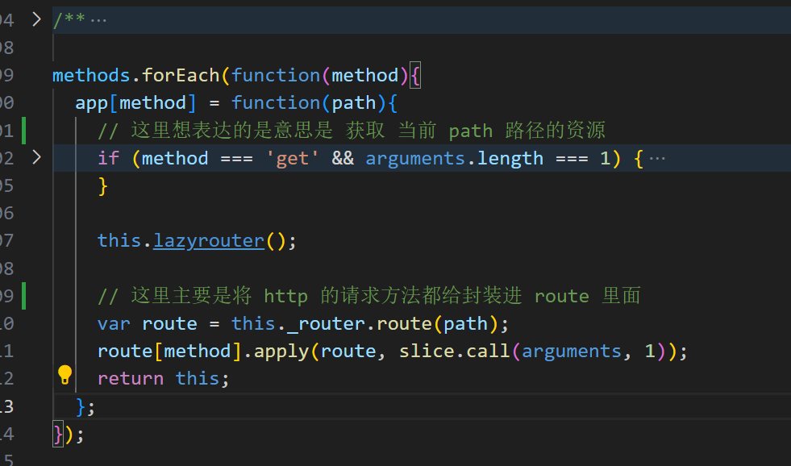
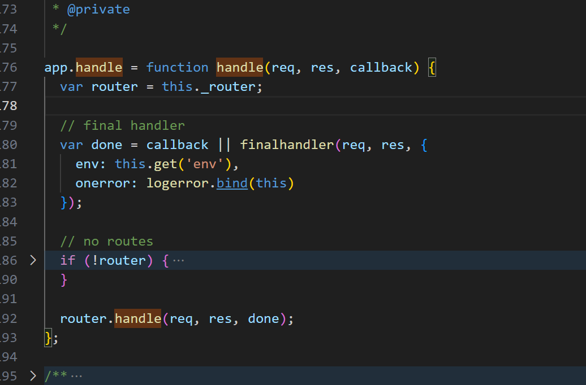
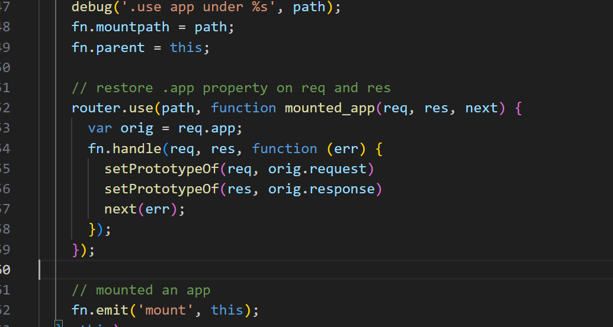
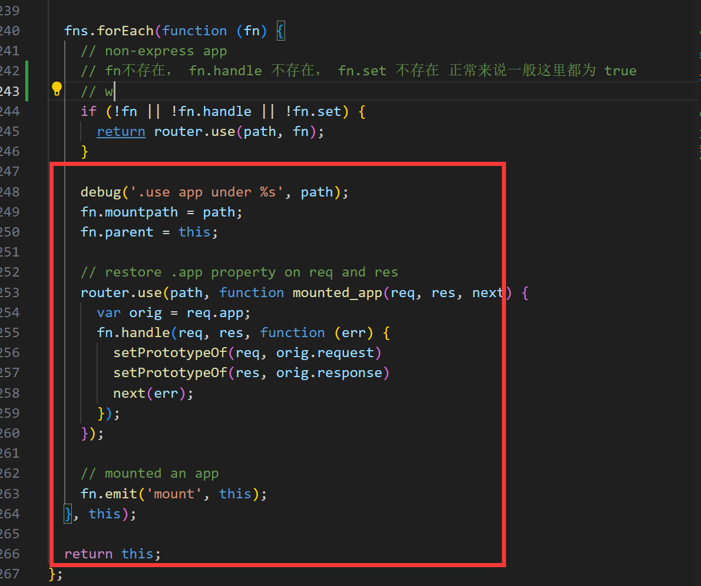
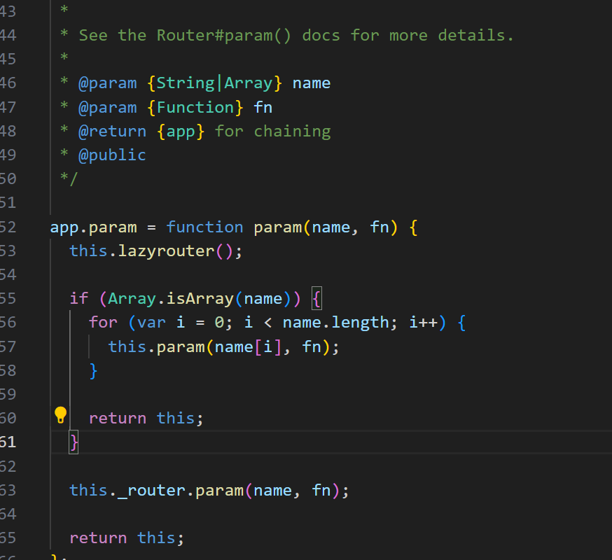
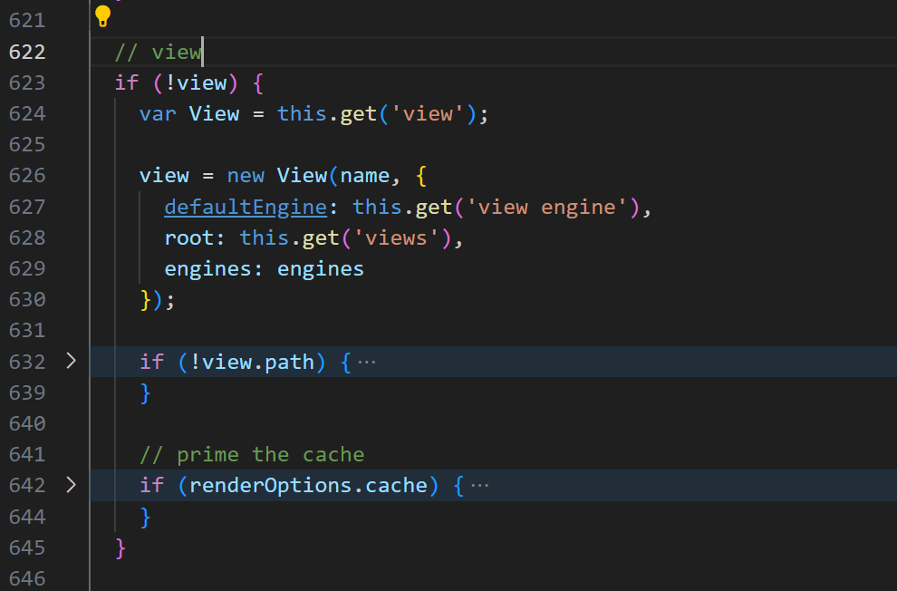

app添加 http 请求的所有方法。内部会执行 route 所对应的请求方法
this.set 方法里面对资源考虑

看看 router 方法

注册的 on 事件的实现

这里有几个问题
首先 route 方法是做了什么
其次为什么要 route[method] 是表明 route 方法 返回的永远都是同一个实例吗

handle 方法不知道 是在哪里调用
调用之后，router里面还会调用 app.handle 方法

finalhandler finalhandler 根据req和res生成个函数，该函数用来发生错误时的情况，而不用我们手动去 res.end('报错啦！')

use 方法里面 fns的 forEach 方法。
内部调用的 router.use 方法

后面这段是代表什么方法被使用，因为正常来说，前面久已经结束了。
目前发现后续是 既然可以调用 fn.emit 所以 fn 本质应该是一个 app

param 调用的 _router.param 方法的实现

all 方法
本质就是 route方法返回对应的 route
然后调用 route[mothods] 全部调用

render 的 view 查看 this.get('view');

