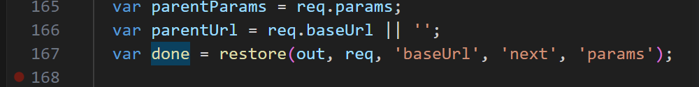

app添加 http 请求的所有方法。内部会执行 route 所对应的请求方法
this.set 方法里面对资源考虑
通过 set 方法发现，没有考虑什么，就是单纯的返回 path 这个属性的值而已


看看 router 方法


# Router 方法


const a = new Router();
这样调用的是 router.handle
a();


## param 方法

内部首先判断第一个参数是不是函数
如果是，那么就会 push 入 _params return
否则 执行 _params 里面的所有方法，得出的最后一个 fn
为 最终的注入的 callback

所以针对一个参数而言，会影响到其后面的 param 调用

使用
```JavaScript
app.param(['id', 'page'], function (req, res, next, value) {
  console.log('param', value)
  next()
})

app.get('/user/:id', function (req, res) {
  console.log('gettwo')
  res.end()
})
```


## handle 方法

针对 done 方法，默认是 restore(out, req, 'baseUrl', 'next', 'params');
<!-- TODO -->


针对 req.method === ‘OPTIONS 的默认返回


### next 方法

就是 use get等方法 里面的 next 方法
<!-- 发现 use 最终会在这里调用上 -->

如果传递的参数是 router 那么就将会直接调用 done 方法

#### done 方法的作用

layer.route.path use 方法没有path get方法等才会有


这里的 next 方法没有理解


## use 和 route

use 方法会在 Layer end为false
route 方法 Layer end 会为 true

最终都会将 fn push 进入 stack 。


# 


注册的 on 事件的实现


这里有几个问题
首先 route 方法是做了什么
其次为什么要 route[method] 是表明 route 方法 返回的永远都是同一个实例吗


handle 方法不知道 是在哪里调用
调用之后，router里面还会调用 app.handle 方法


finalhandler finalhandler 根据req和res生成个函数，该函数用来发生错误时的情况，而不用我们手动去 res.end('报错啦！')


use 方法里面 fns的 forEach 方法。
内部调用的 router.use 方法


后面这段是代表什么方法被使用，因为正常来说，前面久已经结束了。
目前发现后续是 既然可以调用 fn.emit 所以 fn 本质应该是一个 app


param 调用的 _router.param 方法的实现


all 方法
本质就是 route 方法返回对应的 route
然后调用 route[mothods] 全部调用


render 的 view 查看 this.get('view');
查看 View 方法


layer 方法查看


# 如果做到的监听 get 请求。发现没有使用 http.get

没有发现 http 的响应是如何做到的监听的